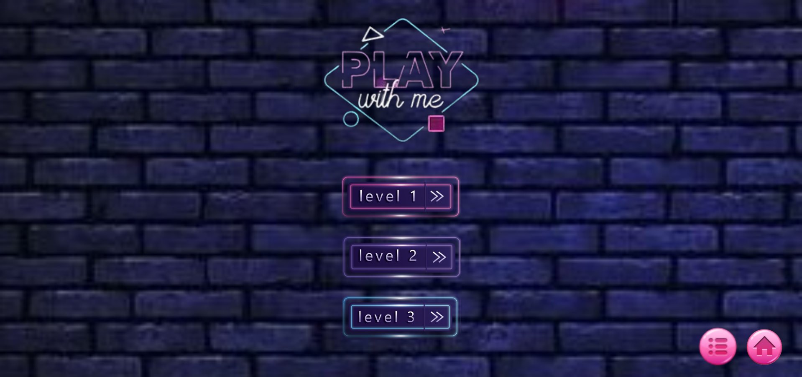
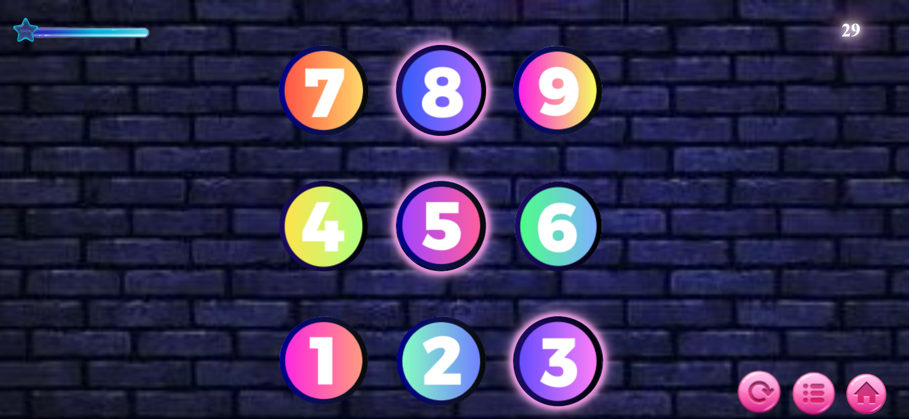
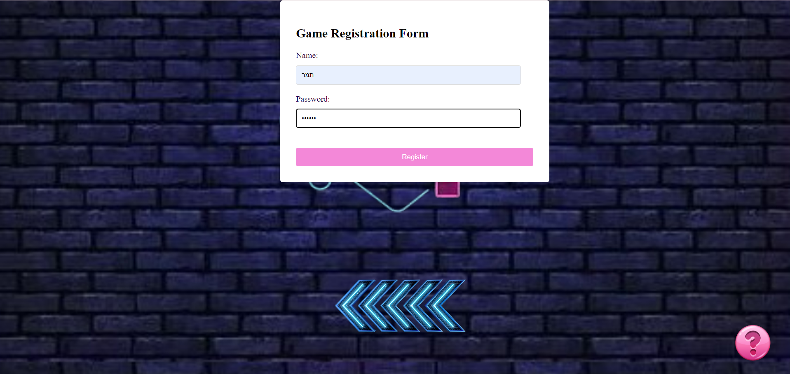

# משחק המהירות - Speed Game

משחק המהירות הוא משחק אטרקטיבי המתבצע בדפדפן, עשוי ב-JavaScript, HTML5, ו-CSS. המשחק מעוצב בצורה מרהיבה עם עיצוב רספונסיבי המאפשר חוויה נעימה על מגוון מכשירים.

## הוראות המשחק:

1. מופיעים על המסך 9 עיגולים של מספרים 1-9.
2. כאשר המשחק מתחיל, יש טיימר המתחיל לספור.
3. על השחקן ללחוץ על המספר המהבהב במהירות על מנת להרוויח נקודות.
4. אם השחקן לוחץ על המספר המתאים בזמן, הוא מרוויח נקודות. אחרת, הנקודות ירדות ומונה החיים מתעדכן.
5. אם מונה החיים של השחקן מגיע ל-0, המשחק נגמר.

## רמות ודרגת קושי:

המשחק מכיל שלושה שלבים עם דרגת קושי שונה. ככל שהשחקן מתקדם בשלבים, המהירות עולה והזמן ללחיצה על המספרים נמוך יותר.

## רישום וניהול שיאים:

כדי לשמור את השיא שלך ולעקוב אחרי ההתקדמות שלך, עליך להירשם עם שם משתמש וסיסמה. הנתונים נשמרים ב-local storage של הדפדפן שלך.

## כיצד להתחיל:

1. הורד את הפרויקט למחשב שלך במקום הרצוי- `git clone https://github.com/rivki-gebel/Numbers-Game.git`
2. פתח את הקובץ `home.html` בדפדפן שלך.
3. הירשם עם שם משתמש וסיסמה.
4. התחל לשחק ותהנה!
